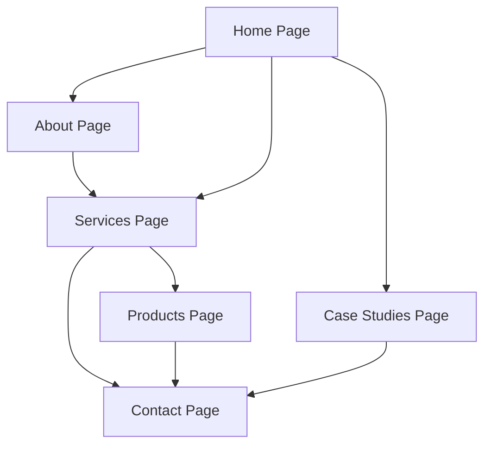

## 1. Product Overview
Wityliti.io is rebranding as a climate tech-first company while maintaining its cybersecurity expertise, positioning itself at the intersection of AI, sustainability, and security. The website rebuild aims to establish market credibility and showcase innovative solutions for the new AI era.

The platform will serve enterprises seeking AI-powered climate solutions and cybersecurity services, helping them achieve sustainability goals while maintaining robust security postures. Target market includes ESG-focused corporations, logistics companies, and organizations investing in carbon offset initiatives.

## 2. Core Features

### 2.1 User Roles
| Role | Registration Method | Core Permissions |
|------|---------------------|------------------|
| Website Visitor | No registration required | Browse all public content, view case studies, download resources |
| Enterprise Client | Contact form/sales qualification | Access detailed service information, request demos, receive proposals |
| Newsletter Subscriber | Email signup | Receive industry insights, product updates, climate tech news |

### 2.2 Feature Module
The Wityliti.io website consists of the following main pages:
1. **Home page**: Hero section with AI-climate focus, service overview, client testimonials, latest insights.
2. **About page**: Company story, leadership team, climate-first mission, cybersecurity heritage.
3. **Services/Solutions page**: Climate tech solutions, AI offerings, cybersecurity services, integrated approaches.
4. **Case Studies page**: Tese.io ESG platform success, Scrollengine logistics optimization, client impact stories.
5. **Products page**: Afforestation.com platform preview, carbon credit monitoring, tree planting initiatives.
6. **Contact page**: Multiple contact channels, consultation booking, office locations, support options.

### 2.3 Page Details
| Page Name | Module Name | Feature description |
|-----------|-------------|---------------------|
| Home page | Hero Section | Display AI-powered climate solutions messaging with animated background showing environmental data visualizations. Include clear CTA buttons for "Explore Solutions" and "View Case Studies". |
| Home page | Service Overview | Showcase three core pillars: Climate Tech Innovation, AI Solutions, Cybersecurity Excellence with brief descriptions and iconography. |
| Home page | Client Testimonials | Rotating carousel featuring quotes from Tese.io, Scrollengine.com, and other enterprise clients with company logos and impact metrics. |
| Home page | Latest Insights | Blog preview section showing 3 latest articles on climate tech, AI innovations, and industry trends with "View All Insights" link. |
| About page | Company Story | Narrative section explaining the evolution from cybersecurity focus to climate tech leadership, including timeline and key milestones. |
| About page | Leadership Team | Professional profiles of key executives with photos, bios, and LinkedIn links, highlighting expertise in AI, climate, and security. |
| About page | Mission & Values | Clear articulation of climate-first commitment, innovation values, and maintaining cybersecurity excellence as core principles. |
| Services page | Climate Tech Solutions | Detailed sections on ESG reporting platforms, carbon monitoring systems, IoT integration, and sustainability dashboards with use cases. |
| Services page | AI Solutions | Showcase machine learning capabilities, predictive analytics, automation tools, and AI consulting services with industry applications. |
| Services page | Cybersecurity Services | Enterprise security offerings, threat detection, compliance solutions, and integrated security for climate tech infrastructure. |
| Case Studies page | Tese.io Success Story | Comprehensive case study on ESG platform implementation, including challenges, solutions, and measurable impact on sustainable finance operations. |
| Case Studies page | Scrollengine Optimization | Detailed analysis of logistics optimization project, AI routing improvements, Shopify integration benefits, and delivery efficiency gains. |
| Case Studies page | Impact Metrics | Visual dashboard showing collective client achievements: CO2 reduction, cost savings, efficiency improvements, and security enhancements. |
| Products page | Afforestation.com Preview | Introduction to upcoming carbon credit platform, tree planting initiatives, monitoring capabilities, and partnership opportunities. |
| Products page | Platform Features | Highlight key functionalities: real-time carbon tracking, satellite monitoring, blockchain verification, and marketplace integration. |
| Contact page | Contact Channels | Multiple contact methods including phone, email, contact form, and live chat with clear response time commitments. |
| Contact page | Consultation Booking | Integrated calendar system for scheduling discovery calls, technical consultations, and partnership discussions with automated confirmations. |

## 3. Core Process
**Visitor Journey Flow**: Users discover Wityliti.io through search engines, social media, or industry referrals. They explore the homepage to understand the company's climate tech focus and AI capabilities. Interested visitors navigate to case studies to validate expertise, then review services for solution fit. Enterprise prospects proceed to contact page for consultations, while others may subscribe to newsletter for ongoing insights.

**Client Onboarding Flow**: Enterprise clients submit contact forms indicating service interest. Sales team qualifies leads and schedules discovery calls. Technical teams conduct needs assessments and propose customized solutions. Contracts are negotiated and projects commence with regular progress updates and impact reporting.

## 4. User Interface Design

### 4.1 Design Style
- **Primary Colors**: Deep forest green (#2D5016) representing climate focus, with tech blue (#1E40AF) accents for AI/cybersecurity elements
- **Secondary Colors**: Clean white backgrounds, light gray (#F8FAFC) sections, success green (#10B981) for positive metrics
- **Button Style**: Rounded corners (8px radius), subtle shadows, hover animations with color transitions
- **Typography**: Inter font family for modern tech feel, with hierarchy: H1 (48px), H2 (36px), H3 (24px), body (16px)
- **Layout Style**: Card-based design with generous whitespace, gradient backgrounds for hero sections
- **Icons**: Minimalist line icons from Heroicons, with animated SVG elements for data visualizations

### 4.2 Page Design Overview
| Page Name | Module Name | UI Elements |
|-----------|-------------|-------------|
| Home page | Hero Section | Full-width gradient background transitioning from deep green to blue, animated particle effects representing data flow, prominent headline text with typewriter animation effect for key terms. |
| Services page | Solution Cards | Three-column grid layout on desktop, single column on mobile, each card features icon, title, description, and "Learn More" link with hover elevation effect. |
| Case Studies page | Success Stories | Large featured image for each case study, client logo overlay, key metrics highlighted in circular badges, testimonial quote with client headshot. |
| Contact page | Form Section | Clean white form with green accent border on focus, real-time validation feedback, integrated map showing office locations, social media icons in footer. |

### 4.3 Responsiveness
Desktop-first design approach with mobile optimization. Breakpoints at 768px (tablet) and 1024px (desktop). Touch-friendly interface with larger tap targets on mobile, swipeable carousels for testimonials, collapsible navigation menu with hamburger icon.

### 4.4 Performance Optimization
Lazy loading for images below the fold, optimized SVG icons, compressed assets, CDN integration for static resources, prefetching for critical pages, and progressive enhancement for JavaScript features to ensure accessibility across all devices and connection speeds.