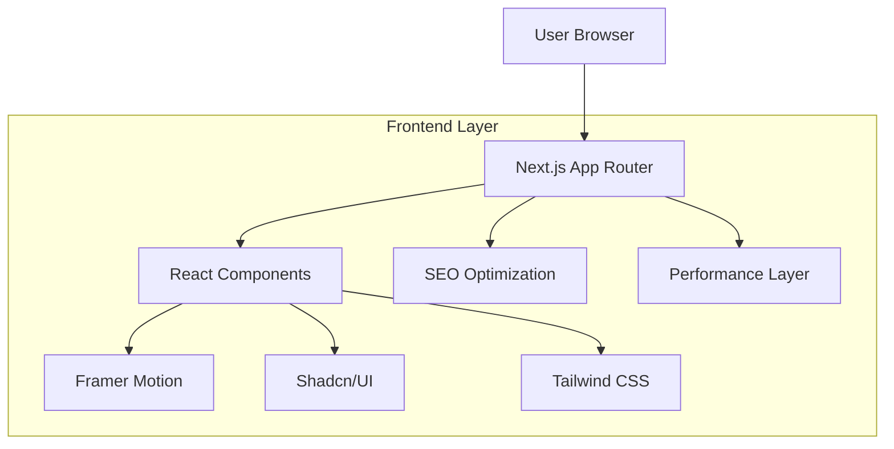
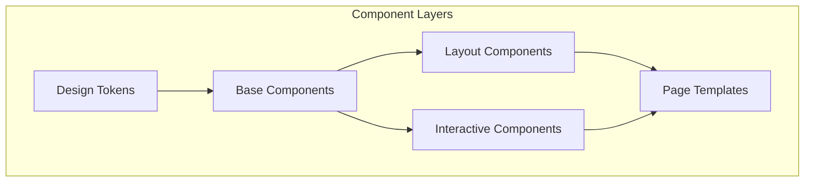

## 1. Architecture design

## 2. Technology Description

- Frontend: Next.js@14 (App Router) + React@18 + TypeScript@5
- Styling: Tailwind CSS@3 + Custom Design System
- Animation: Framer Motion@11 + Lenis (Smooth Scrolling)
- UI Components: Shadcn/UI (Base) + Heavy Customization
- Performance: Next.js Image Optimization + Code Splitting
- SEO: Next.js Metadata API + Structured Data

## 3. Route definitions

| Route | Purpose |
|-------|---------|
| / | Landing page with hero section and company introduction |
| /about | About page showcasing company mission and team |
| /solutions | Solutions page highlighting climate tech and cyber security offerings |
| /contact | Contact page with interactive form |

## 4. Performance & Optimization Strategy

### 4.1 Core Performance Metrics
- **First Contentful Paint (FCP)**: < 1.5s
- **Largest Contentful Paint (LCP)**: < 2.5s
- **Cumulative Layout Shift (CLS)**: < 0.1
- **Time to Interactive (TTI)**: < 3.5s

### 4.2 Optimization Techniques
- **Image Optimization**: Next.js Image component with WebP format
- **Code Splitting**: Dynamic imports for non-critical components
- **Font Optimization**: Variable fonts with font-display: swap
- **Animation Performance**: GPU-accelerated transforms, will-change properties
- **Bundle Size**: Tree shaking, dynamic imports, lazy loading

## 5. Design System Architecture

### 5.1 Component Hierarchy

### 5.2 Design Tokens
- **Colors**: Primary (#00D4FF), Secondary (#FF6B6B), Accent (#4ECDC4)
- **Typography**: Inter (Headers), Inter (Body), JetBrains Mono (Code)
- **Spacing**: 4px base unit, exponential scale
- **Animations**: 200ms-600ms duration, custom easing curves
- **Breakpoints**: Mobile (320px), Tablet (768px), Desktop (1024px), Wide (1440px)

## 6. Animation Architecture

### 6.1 Animation Principles
- **Parallax Scrolling**: Multi-layer depth with different scroll speeds
- **Micro-interactions**: Hover states, loading animations, transitions
- **Scroll-triggered Animations**: Intersection Observer API integration
- **Performance**: RequestAnimationFrame, transform3d for GPU acceleration

### 6.2 Animation Components
- **Hero Animation**: Particle system with Framer Motion
- **Scroll Progress**: Custom hook for scroll-based animations
- **Stagger Animations**: Sequential element reveals
- **Morphing Shapes**: SVG animations for futuristic elements

## 7. Mobile-First Responsive Design

### 7.1 Breakpoint Strategy
- **Mobile First**: Base styles for mobile, enhance for larger screens
- **Touch Optimization**: 44px minimum touch targets
- **Performance**: Reduced animations on mobile, progressive enhancement
- **Navigation**: Hamburger menu with smooth transitions

### 7.2 Responsive Components
- **Flexible Grids**: CSS Grid with auto-fit and minmax()
- **Fluid Typography**: clamp() function for scalable text
- **Adaptive Images**: Responsive images with srcset
- **Container Queries**: Component-level responsive design

## 8. SEO & Accessibility

### 8.1 SEO Implementation
- **Structured Data**: JSON-LD for organization, products, services
- **Meta Tags**: Dynamic meta tags with Next.js Metadata API
- **Sitemap**: Dynamic sitemap generation
- **Performance**: Core Web Vitals optimization

### 8.2 Accessibility Features
- **WCAG 2.1 AA Compliance**: Color contrast, keyboard navigation
- **Screen Reader Support**: ARIA labels, semantic HTML
- **Focus Management**: Visible focus indicators, skip links
- **Reduced Motion**: Respect user preferences for motion

## 9. Development Workflow

### 9.1 Component Development
- **Atomic Design**: Atoms → Molecules → Organisms → Templates
- **Storybook**: Component documentation and testing
- **TypeScript**: Strict type checking throughout
- **ESLint/Prettier**: Code quality and formatting

### 9.2 Testing Strategy
- **Unit Tests**: Jest + React Testing Library
- **Visual Regression**: Chromatic or Percy
- **Performance**: Lighthouse CI integration
- **Cross-browser**: BrowserStack testing